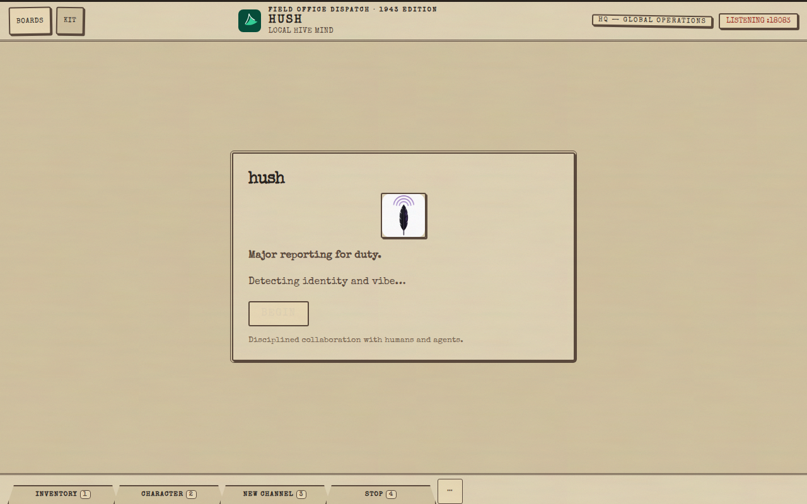

# Hush

**Hush is open-source office collaboration — a Slack/Teams alternative that is AI-assistant-native, wrapped in a Diablo/BG3-inspired field-office UI.**

[](LICENSE)
[](https://github.com/coldcanuk/hush/actions/workflows/ci.yml)


> License verified: [`LICENSE`](LICENSE) is the GNU General Public License, Version 3 (29 June 2007). The badge above reflects the file on `main`, not an assumption.

Hush is a legible C11 Nostr relay core plus a self-hosted team-chat hive: one binary (`hush-relay`) serves the wire protocols and the chat UI on the same port. Name yourself, stand up a vibe (hive), open bulletin-board channels, and raise AI robots that share those channels with humans. Version source of truth: [`VERSION`](VERSION) (currently `0.0.1`).

## Screenshot (real, from this repo's demo on a cloud VM)

Captured 2026-09-24 from a throwaway relay on this base (`44c66f88`, port 18083) with headless Chrome at 1280×800 — first-launch splash, field-office theme, folder-tab quick bar:



More captures (desktop + phone): [`screenshots.md`](screenshots.md) — Armory shelves, Character sheet, three-pane, quick bar, volume dial, thread view.

## Features (only what is verifiably on `main`)

Checked against [`UI_SPEC.md`](UI_SPEC.md) and the served demo (`hush-c/demo/index.html`). Honesty notes included — no phantom claims.

- **Armory ALWAYS-ON / ON-CALL labels** — the skill Armory groups gems on two lifetime shelves labeled exactly `ALWAYS-ON · browser-only` and `ON-CALL · browser-only`, with per-gem lifetime chips. Honest runtime: these are **browser-only product labels, not saved on the relay** — the relay still injects every equipped `SKILL.md` body on every job (`agent_prompt.c` untouched). Scope stays a secondary facet (All / System / This robot tabs); disk stays `$HOME/.hush/skills/{system,user,robots}/`.
- **Minimum one equipped skill (min-1)** — every enabled robot keeps ≥1 equipped skill. Lifting the last worn gem is refused inline with “Keep at least one skill equipped.”; saving an empty draft is refused before any POST; the relay refuses zero-skill `POST /api/agent` loadout writes with 400 and keeps the worn loadout.
- **Thread memory (leave → return)** — `GET /api/thread?root=<64-hex>` returns saved turns plus the rolling brief; the pane paints them under “Thread memory · Saved on this relay”. The browser remembers only the open root id (`localStorage.hush-thread-open`) and reopens it only when the relay confirms saved turns — never painting remembered content, never claiming live what is saved.
- **Quick bar 1–4** — a thin folder-tab strip (`#quick-bar`) with four configurable slots (`#qb-1`…`#qb-4`, defaults Inventory / Character / New channel / Stop) plus a `⋯` gear (`#qb-config` → `#qb-editor`). Keys `1`–`4` fire the slots; typing in inputs/textareas never triggers them. Slots persist in `localStorage.hush-quickbar`.
- **`i` / `c` keys** — `i` opens the selected robot tile's inventory-doll editor (or the expanded 8×5 grid when no tile is selected); `c` toggles the Profile character sheet (read-only equipped strip, no Armory forge). Same typing guards as the quick bar. Escape dismisses exactly one layer at a time.
- **Volume dial** — the dispatch log's scroll lives on a stereo-style VOLUME dial (`#fo-dial`) above Send Dispatch: mouse-wheel over the dial, clockwise/counter-clockwise drag, or arrow/PageUp/PageDown/Home/End keys. The native fat scrollbar stays hidden and the message column owns no in-column chrome (the old M10 track/dot/arrows are gone).

Under the hood (also on `main`): Nostr NIP-01 chat basics, `poll(2)` single-threaded server, RFC 6455 WebSocket plus newline-JSON on the same port, BIP-340-verified `EVENT` ingest, REQ/CLOSE, NIP-42 AUTH-gated private vibes, per-hive session token with loopback-only bind, token-bucket rate limits with honest rejections, and a strict `-std=c11 -Wall -Wextra -Werror -Wconversion -Wshadow` build. Details: [`NOSTR.md`](NOSTR.md), [`SECURITY.md`](SECURITY.md).

## Roadmap (not on `main` — explicitly future)

- **Favorite loadouts (PE-4)** — per-robot named skill sets under `$HOME/.hush/robots/<slug>/loadouts/` (1–8 skills each), atomic load that never passes through empty, unload that clears the favorite association only. No `loadouts/` writes and no favorite picker exist on `main` today.

## Quick start (actually ran on the VM)

These exact commands succeeded on a cloud Ubuntu VM from base `44c66f88`:

```bash
sudo apt-get update
sudo apt-get install -y gcc make libssl-dev libx11-dev python3
./configure
make
make test        # ends with: ALL TESTS PASSED
make install     # installs to ~/.local/bin (no sudo needed)
```

Run it:

```bash
~/.local/bin/hush-relay --no-open 10555   # default port 10555
```

Then open `http://127.0.0.1:10555/` in a Chromium-family browser. First launch walks Identity → Backup (`pass` checked by default) → Vibe → Meet Major. `Close` dismisses the window and leaves the hive standing; `Exit` (`--quit`) stops every process with exit code 0.

Isolated demo run (how the screenshot above was produced):

```bash
cfg=$(mktemp -d); hh=$(mktemp -d)
HUSH_CONFIG_DIR=$cfg HUSH_HOME=$hh ./hush-c/hush-relay --no-open 18083
google-chrome --headless --disable-gpu --no-sandbox \
  --window-size=1280,800 \
  --screenshot=docs/assets/hush-field-office.png \
  http://127.0.0.1:18083/
```

System-wide install and calling: `sudo make install PREFIX=/usr`, conference calls need `coturn` (`turnserver` on PATH) plus Whisper for agent voice. Packaging: `make deb`, `make rpm`, `make flatpak`. See [Installation](#installation) and [`UI_SPEC.md`](UI_SPEC.md) §17.

## Open-source Nostr relay in C11 (self-hosted Slack alternative)

Single binary, set-and-forget self-hosting: `./configure && make && make install`, no runtime dependencies beyond libc, OpenSSL, and X11 headers for window controls. Hive metadata persists in `~/.hush/config/vibe.json` (0600) so rebuilds and `Exit` never force a new vibe; secrets live only in `pass` (`hush/identity/nsec`, `hush/providers/<id>/*`).

## AI-assistant-native team chat (robots share channels with humans)

Raise robots from the KIT menu or inventory: name, required system prompt, one required AI provider (Goose, Grok Build, Codex, Cline, Copilot, Ollama, custom, Gemini/xAI/OpenAI/Anthropic/Deepseek APIs), up to 3 plaintext/Markdown context files. `@`-mention a robot to start a thread; channel policy leashes (open/humans/robots/mixed, off/when-mentioned/confirm-first, burst/jobs/cooldown) decide when robots spend tokens, with honest in-thread leash notes. Provider credentials are hive-global (`Configure Providers` desk + `pass`); each robot stores only a provider id.

## Diablo-style inventory UI with field-office materials

The hive is a 1930s–40s military field-office dispatch: bulletin boards (channels) and individuals (live roster) left, Official Dispatch Log center, Active personnel + Status feed right. The robots inventory is a Diablo/Vein-style spatial grid (compact 4×3, expanded 8×5, equal 1×1 tiles, right-click edit opens the `i` doll editor). Zero hamburger glyphs — BOARDS and KIT stamps only. Seven themes kept (`dark` default set is field-office; also `light`, `color-blind`, `dracula`, `desert`, `monochrome`, `christmas`).

## Installation

From source (all platforms), after the [Quick start](#quick-start-actually-ran-on-the-vm) build:

```bash
./configure
make
make install                 # ~/.local/bin, no sudo
sudo make install PREFIX=/usr  # system-wide
```

Or build packages from source: `make deb` (Debian/Ubuntu), `make rpm` (Fedora/RHEL), `make flatpak` (any distro), `make openbsd` / `make freebsd` (`pkg_add`/`pkg`). Details: [`openbsd/README.md`](openbsd/README.md), [`freebsd/README.md`](freebsd/README.md).

## FAQ

**Is Hush a Slack/Teams replacement?**
That is the goal for small office hives: channels, threads, invites, and AI robots in the same rooms — self-hosted as one C11 binary instead of SaaS.

**Do I need Nostr knowledge to use it?**
No. The chat UI is the product; Nostr (NIP-01 events, NIP-27 mentions, NIP-29-shaped channels) is the wire layer stock clients can also speak. See [`NOSTR.md`](NOSTR.md).

**Are ALWAYS-ON / ON-CALL skills really enforced by the relay?**
No — today they are browser-only labels. The relay injects every equipped skill body on every job. Real prompt tiers are future work.

**Can I save favorite skill loadouts yet?**
Not on `main`. That is the PE-4 roadmap item above.

**Where do secrets live?**
Only in `pass` (plus foreign homes Hush never copies: `~/.config/goose`, `~/.grok/auth.json`, `~/.codex`). `GET` routes never return secret values.

**How do Close and Exit differ?**
Close dismisses the window; the hive keeps listening (re-attach from the launcher). Exit stops every process (exit code 0).

## Docs and development

Plans and research live under `docs/` — never `PLAN_*.md` at the root. Key entries: [`docs/CODEX.md`](docs/CODEX.md), [`docs/pass-integration.md`](docs/pass-integration.md), [`docs/plan/`](docs/plan/), [`docs/research/`](docs/research/), [`docs/ops/`](docs/ops/).

Development uses Codex with worktrees (`gb/<slug>` branches, PR → review → auto-merge, never direct `main` writes). Law: [`PRIME_DIRECTIVE.md`](PRIME_DIRECTIVE.md), [`AGENTS.md`](AGENTS.md), [`BRANCHING.md`](BRANCHING.md). Every `.c`/`.h` follows the machine-legibility standard (`.agents/skills/write-legible-c/SKILL.md`), strict C11 build, `./configure && make && make test`.

Machine-readable summary: [`llms.txt`](llms.txt). Citation: [`CITATION.cff`](CITATION.cff). Ethics: [`CODE_OF_CONDUCT.md`](CODE_OF_CONDUCT.md).
