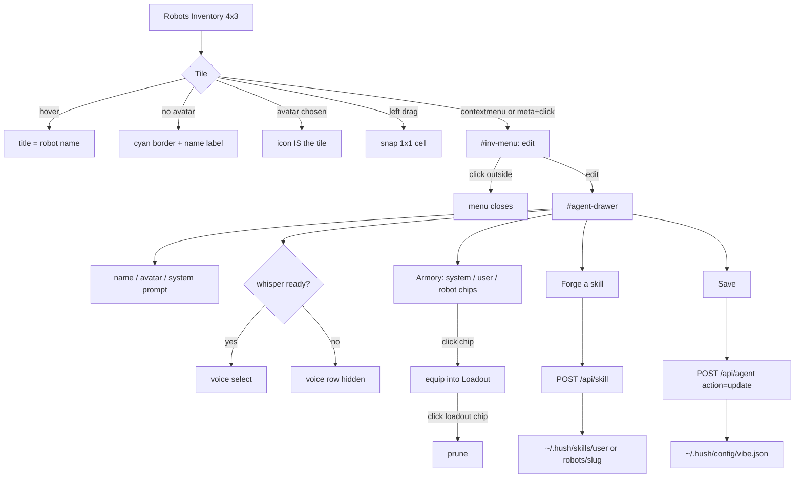
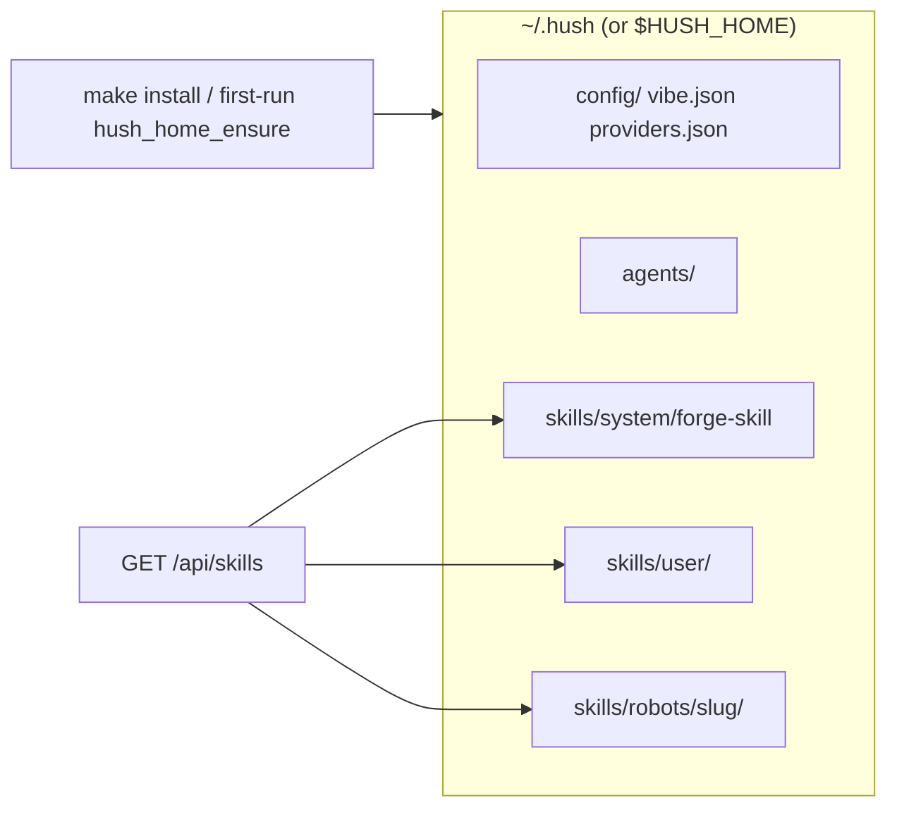

# RESEARCH: Inventory edit, equal-size robot icons, ~/.hush home, skill equip/forge

**Date:** 2026-08-26
**Worktree:** `worktrees/robot-inv-edit` / `gb/robot-inv-edit`
**Methodology:** RDAP Phase 1 — Research & Discovery
**Status:** Synthesis complete. Plan frozen in `docs/plan/PLAN_ROBOT_INV_EDIT.md`.

## 1. Problem

On launch the hive shows **Robots Inventory** with Payne and Happy, but:

1. Tiles are unequal (Payne is seeded `1x3`, Happy `1x1`).
2. There is no reliable **edit** path. Left-click is eaten by inventory drag
   (`pointerdown` + `preventDefault` suppresses `click`).
3. The agent drawer hides Payne’s name and standing orders; save for a
   non-Payne robot always **creates**, never updates.
4. No skill catalog, no equip/prune loadout, no forge path.
5. Config still lives at `~/.config/hush`. The forward standard is `~/.hush/`.
6. Display name is still `Sgt Major Payne`. OBJECTIVE: **Major**, and the
   dialogue may change name and system prompt.

## 2. Current architecture (evidence)

| Area | Fact | Site |
|---|---|---|
| Inventory seed | Payne `sizeKey = "1x3"`, others `"1x1"` | `demo/index.html` `syncInventoryFromRoster` |
| Tile paint | Absolute `.inv-item` sized `w*cell × h*cell`; `.nm` always shown; `.has-pic` covers with atlas cell | `renderInventory` |
| Open editor | `click` on `.inv-item` → `openAgentDrawer`; `pointerdown` starts drag and `preventDefault` | `renderInventory` / `beginInvDrag` |
| Channel menu | `#chan-menu`, `openChanMenu`, `hideChanMenu`, document click outside | `index.html` + CSS `.menu` |
| Agent drawer | `#agent-drawer`: name, prompt, context, 9 providers, picture sheets | markup ~954 |
| Payne lock | `agent-identity` hidden; title `Edit Sgt Major Payne`; POST slug updates providers only | `openAgentDrawer`, `hush_http_update_payne` |
| Agent POST | delete / Payne slug / else **create** (`hush_launch_add_agent`) | `hush_http_serve_agent` |
| Roster persist | vibe.json `agent_name/slug/provider/prompt` — **no picture** | `hush_launch_put_agents` / `take_agent` |
| Payne session | `HUSH_LAUNCH_PAYNE_NAME` constant, not a roster row | `hush_launch.h` / `format_payne_providers` |
| Config dir | `$HUSH_CONFIG_DIR` else `$XDG_CONFIG_HOME/hush` else `$HOME/.config/hush` | `hush_launch_config_dir` |
| Provider overlay | `$XDG_CONFIG_HOME/hush` else `$HOME/.config/hush` (**no** `HUSH_CONFIG_DIR`) | `hush_provider_config_dir` |
| Whisper | `hush_turn_whisper_available()` → `/api/status` `whisper`; UI `whisperReady` | `hush_turn.h`, `tick()` |
| Skills | None in C. Goose skills live in `.goose/skills/` (agent-create, etc.) | repo |
| Install | binary + desktop + icons; does **not** mkdir a user home tree | `hush-c/Makefile` `install` |
| Picture picker | sheets dogs/cats/sheep/virus/robots/angevin; id `panel:<sheet>:<i>` | `paintAgentPicPicker` |

## 3. Constraints

- C11 strict + write-legible-c on every `.c`/`.h`.
- Prime Directive: worktree `worktrees/<slug>` on `gb/<slug>`; land via PR only.
- Embed UI: edit `hush-c/demo/index.html` then `scripts/embed-ui.sh`.
- Tests override homes so they never mkdir the developer’s real `~/.hush`.
- Non-goals: Raylib inventory, variable-size tiles, live LLM forge job,
  full skill executor, migrating `pass`, replacing Payne provider ranking,
  auto-converting every historical `~/.config/hush` file.

OBJECTIVE wins over UI_SPEC Payne name lock.

## 4. Flow (inventory → edit → skills → disk)

## 5. Skill equip UX (character items, not a checkbox dump)

- **Armory** (left): chips grouped by scope — System (brass), User (cyan),
  Robot (violet). Each chip is a skill item.
- **Loadout** (right): the robot’s equipped set (max 8). Empty slots read as
  open gear slots.
- Click armory chip → equip (moves a worn copy into loadout).
- Click loadout chip → prune (unequip; file stays on disk).
- **Forge** opens a small drawer: name, summary, body, scope `user` or
  `this robot`. System scope is shipped-only. Forge writes `SKILL.md` using
  the system-wide **forge-skill** document as the contract.

## 6. Data model (decisions)

### Home

| Env | Meaning |
|---|---|
| `HUSH_HOME` | Root (`…/.hush` layout). Tests set this. |
| `HUSH_CONFIG_DIR` | Config dir override (existing tests). When set **and** `HUSH_HOME` unset, do **not** mkdir `$HOME/.hush`. |
| default | `$HOME/.hush` with `config/`, `agents/`, `skills/{system,user,robots}` |

`hush_home_config_dir`: `HUSH_CONFIG_DIR` else `$HUSH_HOME/config` else `$HOME/.hush/config`.

Read fallback: if new `vibe.json` is missing and `HUSH_CONFIG_DIR` is unset,
read `$HOME/.config/hush/vibe.json`. Writes always go to the new/override path.

### Robot

Payne stays identity `sgt-major-payne` but display name defaults to **Major**
and is stored on `hush_launch_t` (`payne_name`, `payne_prompt`, `payne_picture`,
`payne_voice`, `payne_skills[]`). Roster agents gain `voice` + `skills[]`.
Vibe persist adds `agent_picture`, `agent_voice`, `agent_skill_N`.

Voice ids (shown only when whisper is available): `alloy`, `echo`, `fable`,
`onyx`, `nova`, `shimmer`.

Skill id: `system:<slug>` / `user:<slug>` / `robot:<robot-slug>:<slug>`.

### HTTP

- `GET /api/skills` — catalog + scopes + voices (voices listed; UI gates).
- `POST /api/skill` — forge `{name, summary, body, scope, robot?}`.
- `POST /api/agent` `{action:"update", slug, name, system_prompt, picture, voice, skill_0…}` plus Payne `provider_N`.

## 7. Risks

1. `HUSH_CONFIG_DIR`-only unit tests must not mkdir the real `~/.hush`.
2. `test_provider.c` currently reads `$HOME/.config/hush/providers.json` —
   must follow the new config dir.
3. Headless Playwright may be absent; HTML greps + C tests + two live GETs
   are the accepted bar.
4. Old localStorage `hush-inv` may still hold Payne `w=1,h=3` — force `1×1`
   on sync.

## 8. Synthesis

Implement a `hush_home` + `hush_skill` pair, persist robot extras through
existing vibe.json, equal-size inventory tiles with hover names, a one-item
`edit` context menu (right-click / meta+click), an editor that can change
name/avatar/prompt/(whisper)voice/loadout, a shipped system forge-skill,
and tests that drive those shipped functions. No local merge to main.
